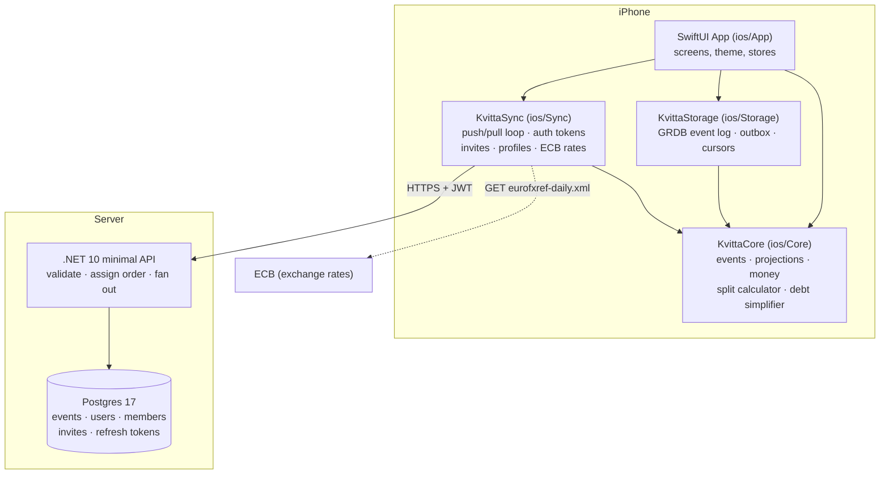
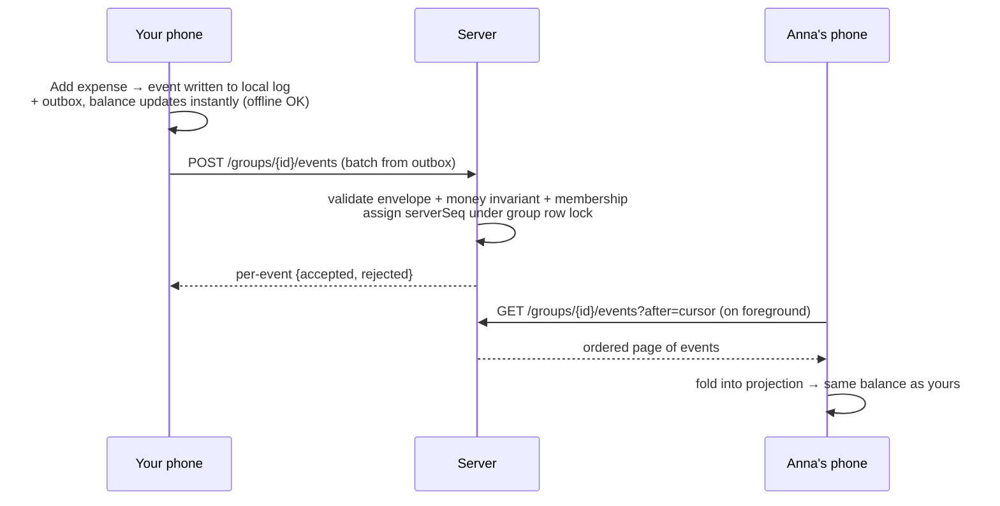
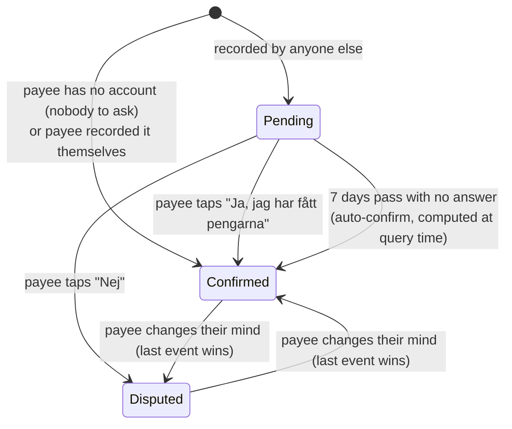
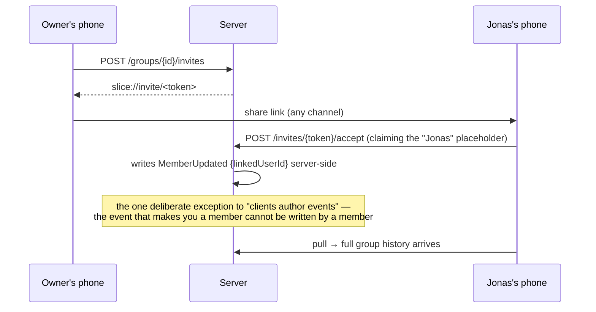

# How Slice works

A guided tour of the whole system — the stack, the data flow, the design decisions and why they
were made, what is verified working, and what is honestly off. Written for the person who owns
the app but did not write every line of it.

Companion documents: [expense-app-sync-design.md](expense-app-sync-design.md) is the original
architecture spec; [session-prompts.md](session-prompts.md) is the milestone log;
[ui-design.md](ui-design.md) covers the visual language. This document is the map that ties them
together. All diagrams are [Mermaid](https://mermaid.js.org) and render directly on GitHub —
open this file in the repo browser to see them drawn.

---

## 1. What the app is

An offline-first expense-splitting app for one friend group — a Splitwise/Steven replacement.
iOS native (SwiftUI), with a deliberately boring .NET backend whose only job is to relay events
between phones. The product principles, which explain most of the architecture:

- **Free forever, for this friend group.** No gating logic, no ads, no code paths for either.
- **No bank sync, ever.** The fragile dependency that killed Steven. Receipt photos someday instead.
- **Every balance is auditable.** Tapping any number shows the exact expenses behind it.
- **The app never moves money.** It deep-links to Swish/MobilePay; money moves bank to bank.
- **Fully functional offline.** A feature that needs a live server to add or view data is a bug.

## 2. Tech stack

| Layer | Technology | Why this one |
|---|---|---|
| iOS app | SwiftUI, iOS 26, light-only custom theme | Native feel; the palette has no dark variant so dark mode is disabled rather than broken |
| Domain logic | `ios/Core` — pure Swift package, **zero dependencies** | Money, events, projections and settlement compile anywhere and are tested in milliseconds |
| Persistence | `ios/Storage` — GRDB (SQLite) | Append-only event log + outbox + sync cursors; the only place GRDB appears |
| Networking | `ios/Sync` — URLSession | The only package that knows a network exists; behind a feature flag |
| Project file | XcodeGen (`project.yml`) | The `.xcodeproj` is generated and gitignored — no merge conflicts in project files |
| Backend | .NET 10 minimal API | One small API, no framework ceremony |
| Database | Postgres 17 (docker-compose locally) | The server's event log of record |
| Auth | JWT (access + rotating refresh), Sign in with Apple seam | Identity = the `sub` claim of a token this server signed |
| Rates | ECB `eurofxref-daily.xml` | Chosen *because* it serves rates as strings — see §6 |

The dependency arrows only point downward-and-inward: the app knows about everything, Core knows
about nothing. That is enforced by Core having zero dependencies — it cannot import UIKit, GRDB
or URLSession even by accident.

## 3. The core idea: an event log, not a database of balances

Slice never stores a balance. It stores **what happened** — an append-only log of immutable
events per group — and computes everything else from it, every launch, in about 20 ms.

- **Events are immutable.** An edit is a new `ExpenseUpdated` event with the full payload; the
  old version stays in the log as history. This is what makes the edit history screen free.
- **`eventId`** is client-generated and is the idempotency key: pushing the same event twice is
  a no-op, which is what makes sync retry-safe.
- **`serverSeq`** is assigned by the server and is the *only* ordering that matters.
  `clientTimestamp` is display-only, because phone clocks lie.
- **Projections are pure functions** `(state, event) → state`. No IO, no side effects, no clock.
  Same log in, same balances out, on every device.
- **Unknown events are skipped, never fatal.** A friend on a newer app version can emit event
  types your build has never heard of; your build ignores them and carries on.

Event types today: `GroupCreated/Updated`, `MemberAdded/Updated/Removed`,
`ExpenseCreated/Updated/Deleted/Restored`, `PaymentRecorded`, `PaymentConfirmed`,
`PaymentDisputed`.

Why per-event accept/reject instead of all-or-nothing batches: one bad event must never sit at
the head of the outbox blocking every good event behind it forever. Why the row lock on
`serverSeq`: a gap in the sequence is worse than a crash, because the puller's cursor would step
over it and an expense would never arrive.

**The server is a fan-out layer, not a brain.** It validates what it understands (envelope
shape, the money invariant, membership) and stores event types it does *not* understand
verbatim. That decision paid for itself twice: multi-currency (M7) and two-sided settle-ups
(M8) both shipped with **zero server changes** — old servers happily relay events only newer
clients can interpret.

## 4. Money: integers only, and the invariant

- Every amount is an **integer in minor units** (öre/øre): `Int64` in Swift, `long` in C#,
  `bigint` in Postgres. There is no `Double` anywhere near money — `437.00` is not exactly
  representable in binary floating point, and "one öre off" is how trust dies.
- Every expense satisfies `sum(payers) == sum(shares) == amountMinor`, validated at
  construction on the client *and* again on the server. An invalid expense is unrepresentable.
- **Rounding happens once**, at creation, deterministically: members sorted by `memberId`,
  remainder distributed from the top. 437,00 kr three ways is always 145,67 / 145,67 / 145,66 —
  the same split on every device, forever, because the resolved shares are stored in the event
  and never recomputed.

Because each expense individually nets to zero, the group's balances always sum to exactly
zero. That is property test P1, run over 1 000 randomly generated histories on every test run.

## 5. Multi-currency — and what "+191,33 kr / −200 DKK" means

**A group is a container of per-currency sub-ledgers.** An expense is exactly one currency; the
*group* can hold SEK and DKK side by side. Each currency bucket is its own independent zero-sum
ledger, and **buckets never net against each other**.

So the Fjällresan card reading:

> **+191,33 kr**
> **−200 DKK**
> you're owed

is *not* a conversion, and not a contradiction. It is two separate facts:

1. **You are owed 191,33 SEK** — you paid Systembolaget 437,00 kr, split three ways
   (+291,33 to you), and Jonas has repaid 100 kr (−100). 291,33 − 100 = 191,33.
2. **You owe 200 DKK** — Jonas paid the 600 DKK dinner in Copenhagen, split three ways.

Why not net them into one number? Because that would require an exchange rate, and *any* rate
turns exact debts into disputed ones ("you converted at yesterday's rate!"). A SEK debt is paid
in SEK, a DKK debt in DKK. The only place currencies are ever combined is the "≈ … totalt" line,
which is explicitly approximate:

- Rates are the **ECB's daily fixing**, fetched from `eurofxref-daily.xml` — chosen over any
  JSON API precisely because that document carries rates as *strings*, which Slice parses with
  string/integer math into millionths (`11.2345` → `11_234_500`). A JSON number would arrive
  through a decoder as a `Double` and violate the no-floats rule before we ever saw it.
- Conversion is **display-only and never stored**, always marked ≈. If the fetch fails, the ≈
  line silently disappears; the exact numbers never depend on it.
- The kr-collision rule: SEK, DKK and NOK all *symbolise* "kr", so any amount not in its
  context's primary currency spells out its ISO code — which is why the card says "−200 DKK",
  never "−200 kr".

*(Honest finding from writing this: the card borrows one direction word — "you're owed" — for
two lines pointing opposite ways. The DKK line carries its minus sign and red colour, but the
question you asked proves it reads ambiguously. Logged in §10.)*

## 6. Settling up: links out, confirmation back

The app never moves money. It builds a prefilled deep link and asks afterwards whether the
payment happened:

- **Swish (SEK):** `swish://payment?data=<json>` with the payee as a quoted, country-coded
  string (`"46701234567"`) — the one shape a real phone accepted (verified 2026-07; the
  `app.swish.nu` universal link and unquoted numbers are both rejected as *"felaktigt format"*).
  No callback URL: coming back is detected from the scene phase, and the callback made Swish
  show an "open Kvitta?" prompt that read like the app wanted something.
- **MobilePay (DKK):** opens the app with the exact amount on the clipboard — there is no
  public person-to-person prefill, and inventing one would be a button that lies.
- `PaymentRecorded` is **pre-staged**: opening Swish is not evidence money moved, so the event
  is only written when you confirm on return. A phantom payment is worse than a missing one —
  the missing one is obvious.

**Whose number gets prefilled?** Your Swish number lives in your *server profile* — a mutable
column, deliberately **not** an event, because an event is immutable and a phone number in the
log would reach every member forever with no way to take it back. It syncs up via
`PUT /me/profile` and co-members' numbers come down via `GET /groups/{id}/payees` into the same
device-local directory the settle-up sheet always read — so fetched and hand-typed numbers
behave identically, and typing stays as the offline/no-account fallback. Clearing the field
withdraws the number for everyone.

### Two-sided settle-up (M8)

Marking a payment as paid no longer moves the balance by itself when the payee could ever
object:

- A **pending** payment moves no balance. Everyone sees it in the "Väntar på bekräftelse" card;
  the payee gets the yes/no buttons and a next-morning notification.
- **Only the payee's word counts.** A confirmation authored by anyone else is skipped as forged
  by the projector — on every device that replays the log, which is what makes the projector,
  not the server, the security boundary. (This guard was proven live during development: a
  confirmation aimed at the wrong payment was silently discarded on the phone.)
- **The never-confirms decision:** auto-confirm after 7 days, computed at query time from the
  payment's own date so projections stay pure. A debt stuck forever because someone stopped
  opening the app would punish the honest payer; the pending week is visible and nudged, and a
  dispute beats the clock.

## 7. Identity, accounts and invites

Signing in is optional — the app without an account is the offline app, fully functional.
Accounts exist so events can sync and so your history survives a lost phone.

- Identity is the `sub` claim of a JWT this server signed. Access tokens are short-lived;
  refresh tokens rotate through one conditional UPDATE, and reusing a spent refresh token
  revokes the whole family (theft containment).
- **Expenses reference members, never users.** A member is a name in a group; a user is an
  account that may *link* to a member. This indirection is what lets you add "Jonas" before
  Jonas has the app, split expenses with him for months, and have him inherit a history that
  already balances when he finally joins by link.

- Invite links are `slice://invite/<token>`. Links minted before the rebrand used `kvitta://`
  and still open — the scheme changed, the token format and the accept endpoint did not.
- Sign in with Apple is fully written but **cannot run without a paid Apple Developer team**
  (the entitlement). Until then a development-only sign-in endpoint stands in, which is also
  what the local seed script uses to fabricate friends. That endpoint mints a token for any
  user id with no credential, which is exactly why exposing the server to the LAN is opt-in
  (§8) rather than the default.

## 8. What runs where: the local dev loop

- **`./tools/trial.sh` → everything, in the right order.** Starts colima if it is down, brings
  Postgres up and waits on its healthcheck, regenerates and opens the Xcode project, prints
  this Mac's current LAN address in the exact form the app's *Serveradress* field wants, and
  runs the backend in the `lan` profile in the foreground. Ctrl-C stops the server; Postgres is
  left up, because the trial data lives in it. The steps that happen on the *phone* — Developer
  Mode, the "Ej betrodd utvecklare" trust step — are not in the script, because no script can
  tap them.
- `colima start && docker compose up -d` (from `backend/`) → Postgres, by hand.
- `dotnet run --project backend/Api` → API on `http://localhost:5142`.
- `python3 backend/ops/seed-dev.py --user <device-uuid>` → three groups of fake friends with
  Swish numbers in their profiles, joined through the real invite flow — nothing bypasses
  validation.
- Backups: `backend/ops/backup.sh`, restore-verified by `backend/ops/verify-restore.sh`,
  because a backup nobody has restored is a hypothesis.
- Build floor: the server refuses clients below build 3 with `426 Upgrade Required` — a build-2
  client would show one-sided balances from the same log, and both phones must agree on what
  the money means before they share a group.

**Loopback is the default, and reaching the LAN is something you ask for.** Plain `dotnet run`
binds loopback only, so a phone gets connection refused while your own simulator works
perfectly — a failure that looks like the app and is the server. `--launch-profile lan` binds
`0.0.0.0`. The server announces which of the two it is on at every start: a warning naming the
reachable addresses when it is exposed, and a line telling you the `lan` flag exists when it is
not. Neither state is silent, which is the whole point — the dev sign-in endpoint mints a token
for any user id with no credential, so on the LAN anyone on the same Wi-Fi can impersonate any
user and read a group's entire money history. Fine at home with friends. Not fine on café Wi-Fi.

## 9. What is verified working

Everything in this list has been exercised end-to-end (simulator against the real local
backend, several flows also on a physical iPhone):

- Offline expense entry in all four split modes, deterministic rounding (437 → 145,67/145,67/145,66 verified through the UI)
- Sync: push, pull, discovery of server-side groups after sign-in, idempotent retries, per-event rejection surfacing
- Invites: create link, accept claiming a placeholder, accept as a new member, full history pull after joining
- Multi-currency groups: separate buckets, explicit ISO codes, currency filter menu, ≈ conversion against live ECB rates (hand-checked against the fixing)
- Swish deep link **on a real phone** (the `swish://payment?data=` shape); MobilePay clipboard flow
- Profile-synced Swish numbers: set in Jag → prefilled on a co-member's settle sheet with no typing; clearing withdraws
- Two-sided settle-up, live: pending froze the balance, the payee's confirmation moved it exactly 69,75 kr, a mis-targeted confirmation was rejected as forged
- Payment reminders (local notifications), balance audit trail, edit history
- **Group photos**: picked on one phone, synced to every member, served only to members, and
  viewable uncropped by tapping the banner. Also one profile picture per person, a group picker
  when adding an expense from the home screen, and a `+` inside a group
- CSV export reconciling öre for öre with the balances screen; Aktivitet filters; per-line
  direction words on every mixed-currency line; group descriptions; a fully English UI on an
  English device
- **"Dela felrapport"** in Jag: a shareable state report with versions, sync state, queue depths
  and rejection codes — and no names or amounts, enforced by test
- **The LAN trial rig**: `./tools/trial.sh` verified from genuinely cold — colima down, no
  server, no generated project — through to `GET /health` answering 200 on the Mac's LAN
  address rather than only on loopback, with the exposure warning firing, and Ctrl-C releasing
  the port with no process left behind

Test suites, all re-run at commit `6bf25a3`:

| Suite | Tests |
|---|---|
| `ios/Core` | **127** in 20 suites, incl. six property tests × 1 000 seeded histories |
| `ios/Storage` | **30** in 6 suites |
| `ios/Sync` | **25** in 4 suites |
| backend | **85** (Testcontainers spins up its own Postgres) |
| AppTests | **9** in 2 suites, on the simulator — the device-local stores |
| **Total** | **276** |

Replay performance, release build (`swift test -c release`), because a debug build is roughly
five times slower and says nothing about a shipped app: **~8.9 µs/event**, flat from 1 000 to
5 000 events — a 5 000-event group replays in **44,5 ms**. That is comfortably invisible at
launch, which is what the in-memory-projection decision rests on (§3). It is *not* the 4,5 µs
measured in July; see §10.

## 10. What is off, missing, or honestly questionable

**The largest gap is not in this list, it is the absence of users.** Everything below was found
by reading the code, running the suites, and driving the simulator. Nothing here has been
falsified by two people using the app on two phones for a week, because that has not happened
yet — it is issues #47 and #48. Treat this section as the best available guess, not as evidence.

**Not verified by hand**
1. **Outbound push has never been exercised from a physical phone.** The fix that makes a local
   write ask for a push immediately, rather than sitting in the outbox until the app is next
   foregrounded, is covered by tests and by the simulator — not by a thumb on a real device.
   It is the half the friend trial leans on hardest: if it is broken, everyone sees only their
   own expenses and the app looks fine right up until two people compare. (#47)
2. **No two physical phones have ever shared a group.** Two-sided settle-up, the invite accept
   flow and profile-synced Swish numbers are all two-party behaviours that a single device
   cannot show. (#48)

**Measured, and different from what this document used to say**
3. **Replay costs ~8,9 µs/event, not the 4,5 µs measured in July** — roughly twice as much, on
   the same command and the same machine class. Six event types and per-currency balance
   buckets have been added since, so this is plausibly the work growing rather than a
   regression, but nobody has proven which. It does not threaten the design: a 5 000-event
   group still replays in 44,5 ms and no group will approach that. Worth re-measuring if it
   doubles again — `CLAUDE.md` carries the same number so the two cannot drift apart quietly.

**UI findings**
4. The floating + button covers the right edge of a group card mid-scroll. Inherent to a
   mockup-specified floating FAB; cosmetic.
5. Swedish hyphenation can break seeded names oddly ("Köpenhamn-shelgen"). Cosmetic,
   locale-driven.

**Known limitations by design (not bugs)**
6. Anyone can still *record* a third-party payment (Ellen → Sara) — deliberately kept for the
   friend-without-the-app case, but since M8 it needs Sara's confirmation to count, which
   defuses the phantom-payment risk.
7. Currency conversion never applies to transfers or stored amounts — only the ≈ display. If
   the ECB fetch fails there is silently no ≈ line.
8. A group's primary currency is frozen once it holds money — relabelling stored amounts would
   move real money.
9. The app is light-only, in two places on purpose (`INFOPLIST_KEY_UIUserInterfaceStyle` and
   `preferredColorScheme(.light)`). The palette has no dark half, and every system-drawn label
   follows the system appearance — so removing one line without the other gives a phone in dark
   mode white text on a cream card.

**Blocked on things outside the code**
10. Sign in with Apple, APNs push, TestFlight — all need the paid Apple Developer team.
    Reminders and settle-up nudges work today because they are local notifications. (#44)
11. **Free-account signing expires after 7 days.** Until the paid team exists, a sideloaded
    build simply stops launching a week later, on your phone and on anyone else's. Nothing in
    the app says so; you find out when it dies.
12. **iOS 26.0 minimum.** Anyone on an older phone cannot install at all, and the failure reads
    like a signing problem rather than a version one.
13. The backend is not deployed anywhere; Dockerfile exists, host undecided, so sync only
    happens on the home network with this Mac awake. Uptime monitoring still waits on that
    decision — there is no URL to watch. Alongside it, the support tooling that needs no host
    exists: **"Dela felrapport"** in Jag produces a shareable, privacy-safe state report
    (versions, sync state, queue depths, skip/rejection codes — no names, no amounts, enforced by
    test), the server logs every rejection with codes and ids only, and production log output is
    structured JSON so whichever host is chosen can search it. (#49)

### Crash reporting (Sentry)

Wired on both sides, and **off unless a DSN is configured** — that is the whole switch. The
server never calls `UseSentry` without `Observability:SentryDsn` (user-secrets or the host's
environment, never a committed file, same rule as the signing key); the app never calls
`SentrySDK.start` without a non-empty `SentryDSN` in its Info.plist. A fresh clone builds, runs
and passes its tests with neither.

The reports carry the same thing the logs already do — ids, not people:

- `SendDefaultPii = false` on both sides, and a pure scrubbing function either side
  (`SentryScrubbing.Scrub`, `Observability.scrub`) drops `Authorization`, cookies, IP addresses
  and the machine name. Both are unit-tested without a DSN or a network.
- Three things are never sent, each set explicitly rather than left to a default: the **request
  body** (a push body *is* the friend group's money history), the **screenshot**, and the **view
  hierarchy** — the last two being every name and amount on screen.
- Group ids, member ids and rejection codes are kept on purpose. A report nobody can act on is
  the reason people switch reporting off.
- No attempt is made to rewrite exception messages. Nothing here puts money or a name into one,
  and a regex sweep over free text would catch the cases we already thought of while giving false
  confidence about the rest.
- `TracesSampleRate` is 0 on both sides. Crashes are the point; a trace of every screen
  transition is a free plan's quota spent on numbers nobody reads.

The server says at boot which mode it is in, for the same reason `DevTokenExposure` does: a
server that has been crashing for a week into a Sentry that was never switched on looks exactly
like a server that has not crashed.

**Not built yet (roadmap)**
14. Receipt scanning — **parked by decision (2026-08-01)**: uncertain anyone would use it when
    typing an amount takes five seconds. The mockups show it; nothing in the app pretends it
    exists. Revisit only if real usage asks for it.
15. Notification inbox (#50) and dark mode (#51) are what remain on the roadmap — and both are
    deliberately blocked on the trial, because "the last item on the list" is not the same thing
    as "the right next thing". Receipt scanning was parked on exactly that reasoning.

---

*Last updated at commit `6bf25a3`, with every test suite re-run rather than quoted. When
behaviour and this document disagree, trust the code and the test suites — then fix the
document.*
